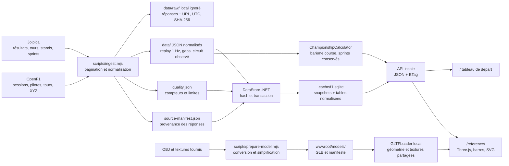

# Lineage local

Le téléchargement et la normalisation initiale sont dans Node. Les réponses brutes sont conservées uniquement dans un cache de préparation, exclu de Git ; les fixtures normalisées et leur provenance suffisent au lancement local. Un clone ne possède donc pas nécessairement le cache raw permettant une réingestion Node avec `--offline`.

Au démarrage, .NET importe les JSON dans SQLite. Les hashes identiques sont ignorés, les ressources modifiées remplacées et les ressources disparues retirées, dans une transaction. Le serveur charge ensuite les snapshots en mémoire : une modification de fixture demande un redémarrage ou une nouvelle exécution d'import pour être visible dans l'API. La télémétrie SQL sert au contrôle et à l'exploration ; l'API replay sert le snapshot JSON déjà réduit.

La scène transforme uniformément les XYZ en `(x, z, -y)`, recentre le tracé et normalise la longueur de la polyligne fermée à 600 unités d'affichage. Les voitures conservent leurs coordonnées observées après cette transformation ; elles ne sont pas projetées sur la chaussée. La route illustrée utilise 1 200 stations espacées régulièrement, puis un filtre horizontal de poids `1, 2, 3, 2, 1` sur cinq stations pour éviter les replis dus aux petits reculs de télémétrie. Le `z` interpolé de chaque station reste conservé ; aucune altitude mesurée n'est annoncée. La largeur de 1,2 unité, les accotements et les vibreurs sont des proportions d'affichage. Voir `frontend/src/track-layout.js` et `road.js`. Les fixtures source ne sont pas modifiées.

Les gaps proviennent des observations brutes avant réduction ; le bump chart utilise la granularité de passage de tour Jolpica. Le championnat calcule des points avec les arrivées connues ; les sprints sont conservés.

La voiture suit un lineage séparé : le modèle fourni et ses textures sont préparés une fois dans `/models/f1-2026.glb`, avec un manifeste de hashes et de transformations. Les participants chargent ce fichier déjà prêt ; ils n'exécutent pas la conversion. Le maillage concept 2026 illustre les données 2024. Voir [la fiche du modèle](../wwwroot/models/README.md) et [les sources](sources.md).

Pour remonter un chiffre visible : **élément UI → endpoint → fichier JSON → fonction de normalisation → entrée `sources`**. Consulter [le dictionnaire](dictionnaire-donnees.md) et [les règles qualité](qualite.md) pour les unités et limites.
